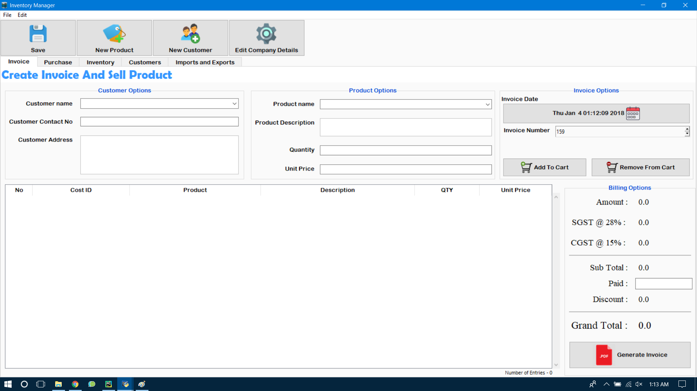
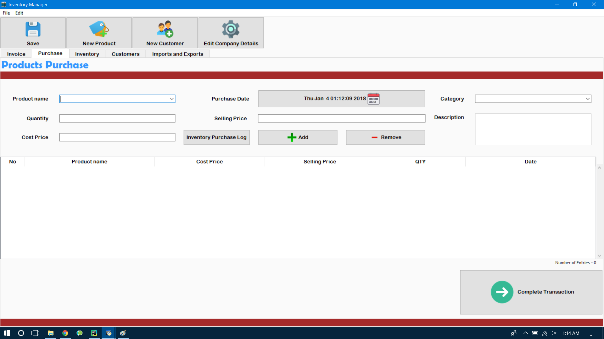
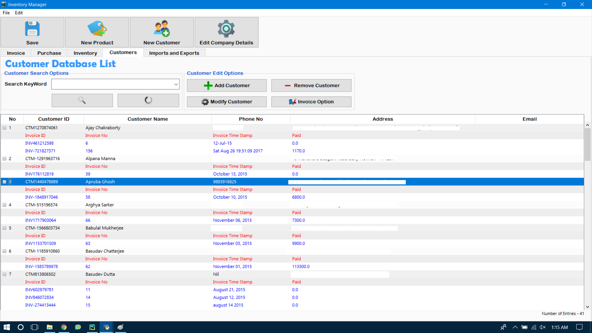
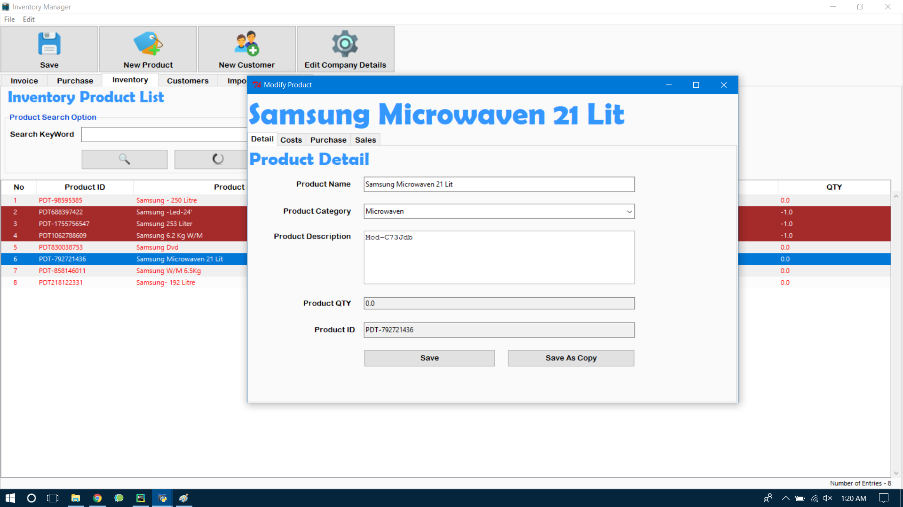
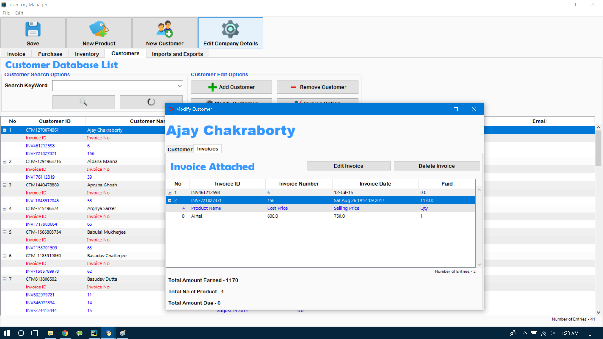
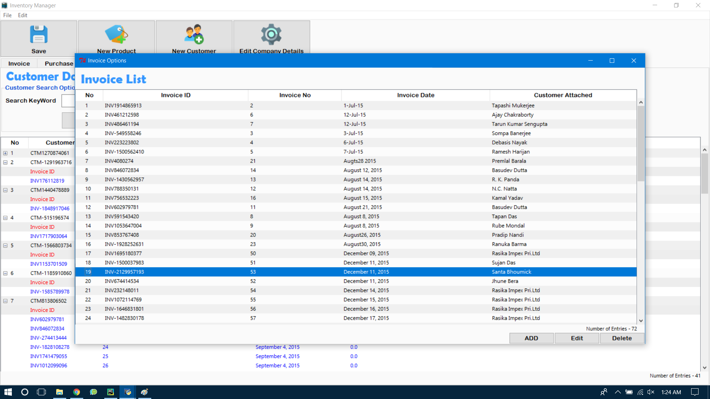
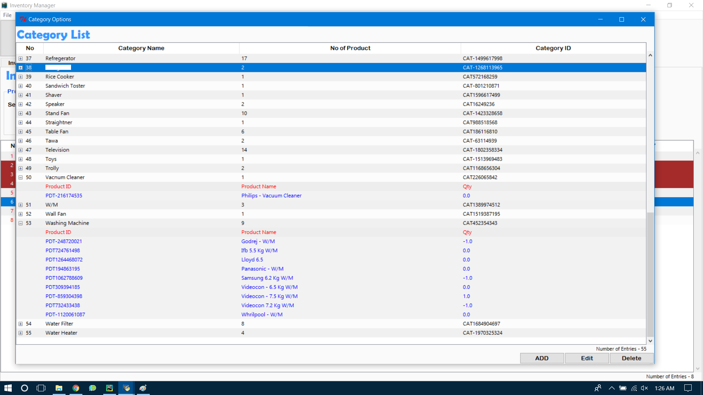

# IMS-2.0
Inventory Management System 2.0

1. Written in `Python`
2. `Sqlite` Database as back-end.
3. `Tkinter` as front-end.
4. Export Invoice As PDF.
5. Uses `ReportLab` to Export PDF.

### Dependencies 

- Sqlite
- Tkinter
- ReportLab
- Pillow

### Examples
#### Selling Page

#### Purchase Page

#### Inventory Page

#### Customer Page

#### CSV Export - Import Page

#### Product Page

#### Customer Details Page

#### Customer Invoice Page

#### Invoice Page

#### Category Page

